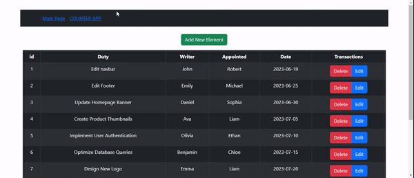

# redux_toolkit_app

#ReduxToolkit

Benefits:

- It contains much less code than Redux.
- Embedded middleware available.
- We can use thunk without any extra processing.
- Thanks to the Devtools plugin, the store can be monitored more easily.
- data management easier.
# # Setup

- Libraries:
- - redux
- - react-redux
- - @reduxjs/toolkit
- - react-bootstrap
- - react-router-dom
